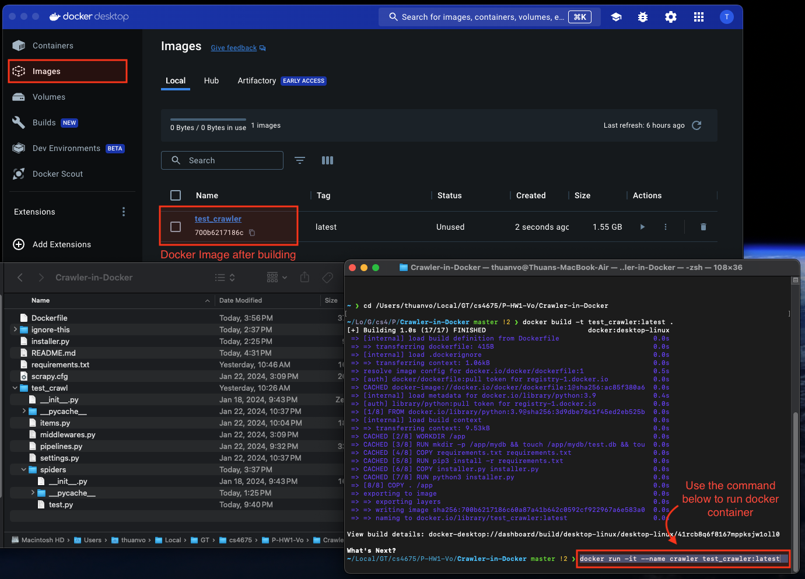
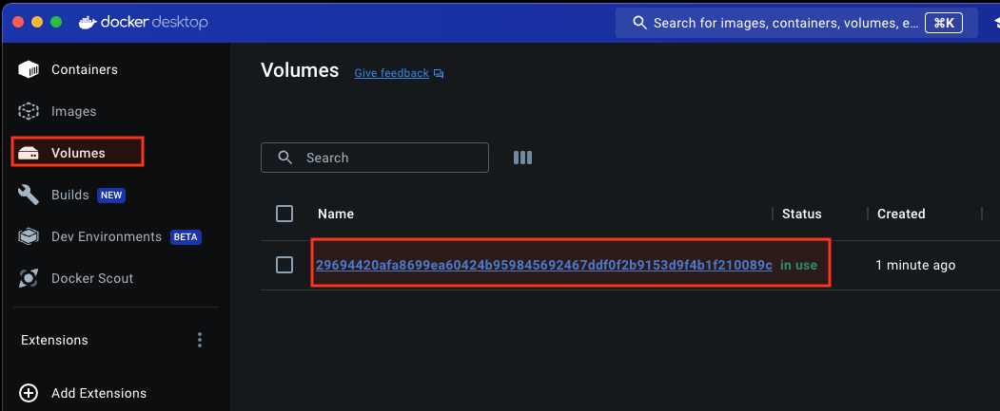

# Crawler

A simple crawler is running based on open-source Python library, namely Scrapy.

## Description

This Crawler only focuses on `https://appleinsider.com` and domain `appleinsider.com`.

This crawler avoid subdomain such as `forum.appleinsider.com`, etc.

## Dependencies

- Docker
- Sqlite3
- Python
  - Scrapy
  - Fake-Agent
  - rake_nltk

## Installing

1. Since this program is running in Docker, use this link [https://docker.com](https://docs.docker.com/get-docker/) to download Docker for your OS.

   - Dockerfile includes the instruction to install `requirements.txt`.

2. Go to directory `Crawler-in-Docker` in HW1 folder. You should see a list of folder and file, a file named `Dockerfile` is used to build docker image.


3. On your Terminal or Commandline, run the following to build. Allow a few minutes to download dependencies and keyword extractor library.

```bash
docker build -t test_crawler:latest ./
```

Where `test_crawler:latest` is image name and its tag.


4. Open Docker Dashboard to check if the build image is ready.

## Executing program

- On your Terminal or Commandline, run the following to run:

```bash
docker run -it --name crawler test_crawler:latest
```



- The output should look like:

```bash
========================================
Database path: /app/mydb/test.db
Size of database: 1163.264 KB
========================================
Number of URLs found: 738
Number of URLs crawled: 43
Number of URLs to be crawled: 693
Number of keywords extracted: 9824
========================================
```


### Method 1: Obtain the database in Container Files

1. Open Docker Container is running, or paused. You will **LOSE** all the database if you stop the container.

2. Go to tab `Files`, go to folder `app` > `mydb`

3. Pick either `log.log` to see all the logging the Scrapy Crawler produce, or `test.db` is the `Sqlite3` database generated by the crawler.

4. Right click and click `Save`, and pick the location where you would like to store the result database on your machine.


### Method 2: Obtain the database in Volumes

1. Open Docker Desktop, on tab Volumes, there is a generated volume to store the database.



2. Pick either `log.log` to see all the logging the Scrapy Crawler produce, or `test.db` is the `Sqlite3` database generated by the crawler.

3. Right click and click `Save As`, and pick the location where you would like to store the result database on your machine.


## Demo

### Output when crawling:


## Design of Database

### How do I store pages, keywords

### Pages Table

- `pages` table contains `crawled_url` and its unique `ID`, to references in the `keywords` table.

```sql
CREATE TABLE IF NOT EXISTS pages (
                id INTEGER PRIMARY KEY AUTOINCREMENT,
                url TEXT NOT NULL UNIQUE
            );
```

### Keywords

- `keywords` table contains `url` and `keywords` since 1 url can contains many keywords.

- Firstly, I had `url INTEGER` to reference url_id in `pages` table. However, for the purpose of inspecting the database, I replaced with URL text.

- In the search engine, this `url TEXT` should be `url_id INTEGER`.

```sql
CREATE TABLE IF NOT EXISTS keywords (
                id INTEGER PRIMARY KEY AUTOINCREMENT,
                url TEXT,
                keyword TEXT
            );
```

### To be Crawled

- `to_be_crawled` table helps the crawler to pause and restart where it has stopped anytime.

```sql
CREATE TABLE IF NOT EXISTS to_be_crawled (
                id INTEGER PRIMARY KEY AUTOINCREMENT,
                url TEXT NOT NULL UNIQUE
            );
```

### All pages

- `all_pages` table helps to find the new unique urls by taking the formular:

`all_new_urls_from_page - all_existed_urls_in_db`

```sql
CREATE TABLE IF NOT EXISTS all_pages (
                id INTEGER PRIMARY KEY AUTOINCREMENT,
                url TEXT NOT NULL UNIQUE
            );
```

---

### Result `log.log` of the first crawl:

```bash
2024-01-25 03:47:13 [scrapy.utils.log] INFO: Scrapy 2.11.0 started (bot: test_crawl)
2024-01-25 03:47:13 [scrapy.utils.log] INFO: Versions: lxml 5.1.0.0, libxml2 2.12.3, cssselect 1.2.0, parsel 1.8.1, w3lib 2.1.2, Twisted 22.10.0, Python 3.9.18 (main, Jan 17 2024, 05:48:03) - [GCC 12.2.0], pyOpenSSL 24.0.0 (OpenSSL 3.2.0 23 Nov 2023), cryptography 42.0.1, Platform Linux-6.5.11-linuxkit-aarch64-with-glibc2.36
2024-01-25 03:47:13 [scrapy.addons] INFO: Enabled addons:
[]
2024-01-25 03:47:13 [asyncio] DEBUG: Using selector: EpollSelector
2024-01-25 03:47:13 [scrapy.utils.log] DEBUG: Using reactor: twisted.internet.asyncioreactor.AsyncioSelectorReactor
2024-01-25 03:47:13 [scrapy.utils.log] DEBUG: Using asyncio event loop: asyncio.unix_events._UnixSelectorEventLoop
2024-01-25 03:47:13 [scrapy.extensions.telnet] INFO: Telnet Password: 0c8462797d4df232
2024-01-25 03:47:13 [scrapy.middleware] INFO: Enabled extensions:
['scrapy.extensions.corestats.CoreStats',
 'scrapy.extensions.telnet.TelnetConsole',
 'scrapy.extensions.memusage.MemoryUsage',
 'scrapy.extensions.logstats.LogStats']
2024-01-25 03:47:13 [scrapy.crawler] INFO: Overridden settings:
{'BOT_NAME': 'test_crawl',
 'FEED_EXPORT_ENCODING': 'utf-8',
 'LOG_FILE': '/app/mydb/log.log',
 'NEWSPIDER_MODULE': 'test_crawl.spiders',
 'REQUEST_FINGERPRINTER_IMPLEMENTATION': '2.7',
 'ROBOTSTXT_OBEY': True,
 'SPIDER_MODULES': ['test_crawl.spiders'],
 'TWISTED_REACTOR': 'twisted.internet.asyncioreactor.AsyncioSelectorReactor',
 'USER_AGENT': 'Mozilla/5.0 (Windows NT 10.0; Win64; x64) AppleWebKit/537.36 '
               '(KHTML, like Gecko) Chrome/117.0.0.0 Safari/537.36 '
               'Edg/117.0.2045.36'}
2024-01-25 03:47:13 [scrapy_fake_useragent.middleware] DEBUG: Loaded User-Agent provider: scrapy_fake_useragent.providers.FakerProvider
2024-01-25 03:47:13 [scrapy_fake_useragent.middleware] INFO: Using '<class 'scrapy_fake_useragent.providers.FakerProvider'>' as the User-Agent provider
2024-01-25 03:47:13 [scrapy.middleware] INFO: Enabled downloader middlewares:
['scrapy.downloadermiddlewares.robotstxt.RobotsTxtMiddleware',
 'scrapy.downloadermiddlewares.httpauth.HttpAuthMiddleware',
 'scrapy.downloadermiddlewares.downloadtimeout.DownloadTimeoutMiddleware',
 'scrapy.downloadermiddlewares.defaultheaders.DefaultHeadersMiddleware',
 'scrapy_fake_useragent.middleware.RandomUserAgentMiddleware',
 'scrapy_fake_useragent.middleware.RetryUserAgentMiddleware',
 'scrapy.downloadermiddlewares.redirect.MetaRefreshMiddleware',
 'scrapy.downloadermiddlewares.httpcompression.HttpCompressionMiddleware',
 'scrapy.downloadermiddlewares.redirect.RedirectMiddleware',
 'scrapy.downloadermiddlewares.cookies.CookiesMiddleware',
 'scrapy.downloadermiddlewares.httpproxy.HttpProxyMiddleware',
 'scrapy.downloadermiddlewares.stats.DownloaderStats']
2024-01-25 03:47:13 [scrapy.middleware] INFO: Enabled spider middlewares:
['scrapy.spidermiddlewares.httperror.HttpErrorMiddleware',
 'scrapy.spidermiddlewares.offsite.OffsiteMiddleware',
 'scrapy.spidermiddlewares.referer.RefererMiddleware',
 'scrapy.spidermiddlewares.urllength.UrlLengthMiddleware',
 'scrapy.spidermiddlewares.depth.DepthMiddleware']
2024-01-25 03:47:13 [scrapy.middleware] INFO: Enabled item pipelines:
[]
2024-01-25 03:47:13 [scrapy.core.engine] INFO: Spider opened
2024-01-25 03:47:13 [scrapy.extensions.logstats] INFO: Crawled 0 pages (at 0 pages/min), scraped 0 items (at 0 items/min)
2024-01-25 03:47:13 [scrapy.extensions.telnet] INFO: Telnet console listening on 127.0.0.1:6023
2024-01-25 03:47:13 [scrapy.downloadermiddlewares.redirect] DEBUG: Redirecting (301) to <GET https://appleinsider.com/robots.txt> from <GET https://www.appleinsider.com/robots.txt>
2024-01-25 03:47:13 [scrapy.core.engine] DEBUG: Crawled (200) <GET https://appleinsider.com/robots.txt> (referer: None)
2024-01-25 03:47:13 [scrapy.downloadermiddlewares.redirect] DEBUG: Redirecting (301) to <GET https://appleinsider.com/> from <GET https://www.appleinsider.com>
2024-01-25 03:47:13 [scrapy.core.engine] DEBUG: Crawled (200) <GET https://appleinsider.com/robots.txt> (referer: None)
2024-01-25 03:47:14 [urllib3.connectionpool] DEBUG: Starting new HTTPS connection (1): publicsuffix.org:443
2024-01-25 03:47:14 [urllib3.connectionpool] DEBUG: https://publicsuffix.org:443 "GET /list/public_suffix_list.dat HTTP/1.1" 200 83756
2024-01-25 03:47:14 [scrapy.core.engine] DEBUG: Crawled (200) <GET https://appleinsider.com/> (referer: None)
2024-01-25 03:47:15 [scrapy.core.engine] INFO: Closing spider (finished)
2024-01-25 03:47:15 [scrapy.statscollectors] INFO: Dumping Scrapy stats:
{'downloader/request_bytes': 1413,
 'downloader/request_count': 5,
 'downloader/request_method_count/GET': 5,
 'downloader/response_bytes': 46441,
 'downloader/response_count': 5,
 'downloader/response_status_count/200': 3,
 'downloader/response_status_count/301': 2,
 'elapsed_time_seconds': 1.877168,
 'finish_reason': 'finished',
 'finish_time': datetime.datetime(2024, 1, 25, 3, 47, 15, 311402, tzinfo=datetime.timezone.utc),
 'httpcompression/response_bytes': 258945,
 'httpcompression/response_count': 3,
 'log_count/DEBUG': 99,
 'log_count/INFO': 14,
 'memusage/max': 82485248,
 'memusage/startup': 82485248,
 'response_received_count': 3,
 'robotstxt/request_count': 2,
 'robotstxt/response_count': 2,
 'robotstxt/response_status_count/200': 2,
 'scheduler/dequeued': 2,
 'scheduler/dequeued/memory': 2,
 'scheduler/enqueued': 2,
 'scheduler/enqueued/memory': 2,
 'start_time': datetime.datetime(2024, 1, 25, 3, 47, 13, 434234, tzinfo=datetime.timezone.utc)}
2024-01-25 03:47:15 [scrapy.core.engine] INFO: Spider closed (finished)
```

## Result (Ethernet Connection 300 Mbps)

### Data obtained:

- [test.db on GG Drive](https://drive.google.com/file/d/1UfkA5-ebL_-XVRjwBwhQDzJaamVS2OGu/view?usp=sharing) is database I obtained after crawling about 6000 pages.

- [statistics.xlsx](./result/statistics.xlsx) includes manipulated data and graphs

- [keywords.csv on GG Drive](https://drive.google.com/file/d/1YwhpEgu63KIe9Yvdug7sTAm5GVGlEWpJ/view?usp=sharing) includes all the extracted keywords

- [pages.csv on GG Drive](https://drive.google.com/file/d/11RycwNCrPh1W2akQw7siEKyh6LMFCr-u/view?usp=sharing) includes all crawled page urls

- [log.log on GG Drive](https://drive.google.com/file/d/1DLpX0tme-JZYnuu7Vamem77o-mFBK-t1/view?usp=sharing) is the program logging

## Analysis

### Number of URLs the crawler was able to crawl: **`6730`**

### How long does it take? `5 hours 45 minutes`

### Plot the crawl speed (total keywords, total number of URLs, number of crawled URLs)

I used Logarithmic Scale for this plot.


### Plot total unique new URLs found, total crawled URLs, and total to be crawled URLs


### Plot time spent to download a page in second


### Plot time spent to process content of page to get keywords


## Additional Analysis

#### 1. #pages/minute: `19.35112858` or `19`

#### 2. Average URLs crawled/URLs to be crawled: `0.314822966`

#### 3. #keywords/minute: `6825.577227` or `6826`

#### 4. Average time spent to download pages: `0.367434083` seconds

#### 5. Average time to process keywords over time: `0.005804636` seconds

### How long does it take to crawl 10 millions and 1 billion pages?

If it can process 19 pages per minutes, it takes `526,316` minutes or `8,772` hours or `365` days to crawl 10 millions pages.

To crawl 1 billion pages, it takes `52,631,579` minutes, or `877,193` hours, or `36,550` days, or `100` years.

## Discussions about my experience and lesson learned

Since this crawler runs in a single thread, the significant limitation is its speed. Reasons for the extended time to crawl just 6000 pages include:

- Executing Sqlite3 commands to obtain the number of rows in the table to find unique URLs each time the crawler processes a URL.

- A single thread performing all tasks, resulting in wasted time and computer power.

- Despite impressive keyword extraction speed, with an average time of 0.005804636 seconds and 6826 keywords/minute, database writing consumes most of the time.

A problem encountered when using a crawler purely with Sqlite3 is concurrency issues with multi-threading, resulting in "Cannot open database file" or "Cannot find the database file" errors. Building a single-threaded crawler that processes one URL at a time resolved this issue.

I learned that selecting the right database is crucial when building a crawler to ensure good concurrency support.

Instead of extracting all possible URLs on pages, future implementations can follow patterns to determine "to be crawled URLs." This can speed up the crawler by reducing the need for a unique URL checker.

Why don't I use a dictionary in Python to store data?

- I would like to try the resume feature, which dictionary in python may be difficult to obtain.

- To resume the crawler, disable 4 lines in the `test.py` and re-run the crawler.
